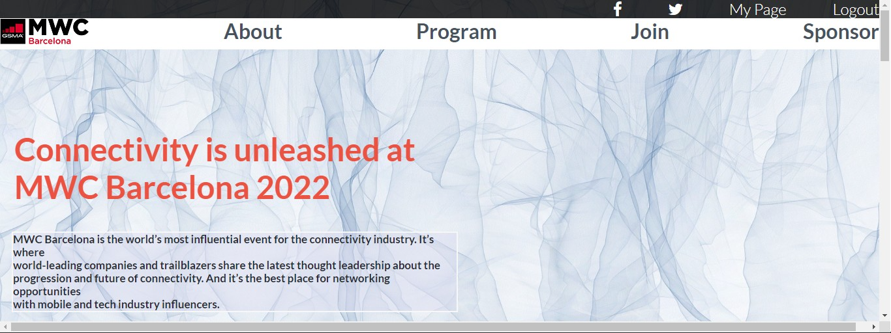
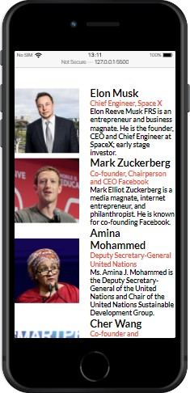
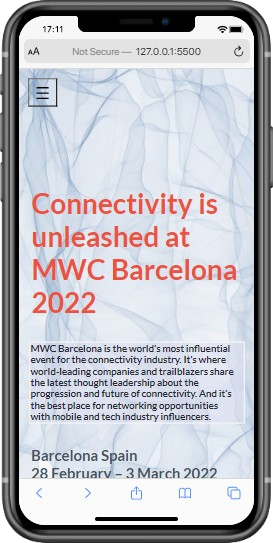

# Capstone1

> This project is my first Microverse Front End Capstone project using Front end tools. 

This project is simple and minimalistic with only a Home page and an About page, it is responsive.

## Built With

- HTML5
- CSS
- Javascript and Dom

## Live Demo

[Live Demo Link](https://livedemo.com)

## Getting Started

To get a local copy just download the repository ZIP, UNZIP then open the Index.html file.

## Authors

👤 **Author**

👤**Amel Khiri**

- GitHub: [@Algerina](https://github.com/Algerina)
- LinkedIn: [@Amel Khiri](https://linkedin.com/in/amel-khiri-qahwadji-37a550135)

## 🤝 Contributing

Contributions, issues, and feature requests are welcome!

Feel free to check the [issues page](https://github.com/algerina/Capstone1/issues).

## Show your support

Give a ⭐️ if you like this project!

## Acknowledgments

- Hat tip to anyone whose code was used
- Inspiration [Cindy Shin in Behance](https://www.behance.net/adagio07)

## 📝 License

This project is [MIT](./MIT.md) licensed.
Thanks to [Microverse](https://www.microverse.org/)

### Creative Commons

Design idea by [Cindy Shin in Behance](https://www.behance.net/adagio07)